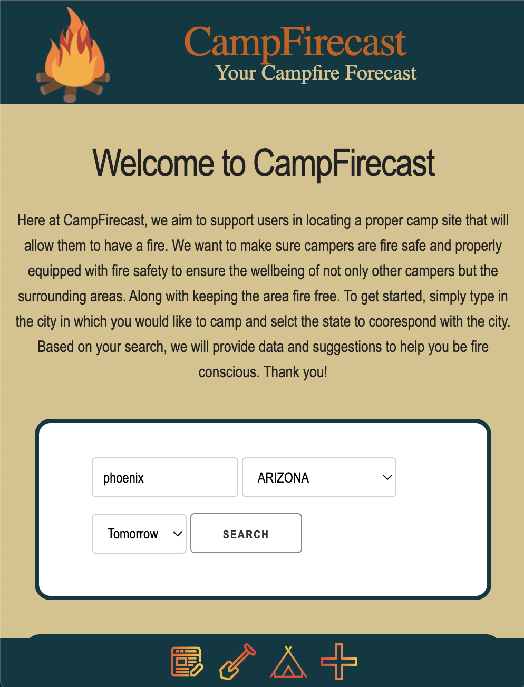
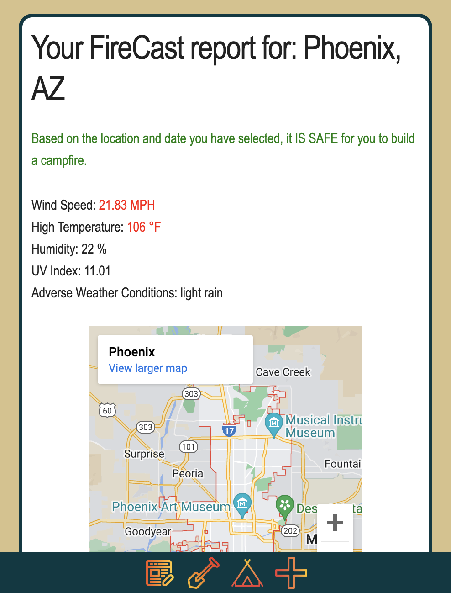

# camp-firecast

## Purpose
* CampFirecast is an interactive website that displays crucial weather information to help the user decide if it is safe for them to enjoy a campfire.

* This project uses a weather API (OpenWeatherMap) to pull weather information and displays the data with corresponding colors (orange and red) to visualize when the conditions are in the intermediate or dangerous range. We have also included another API (Google Maps) to display a map of the selected area.

* In order to use this website, the user should enter a city name in the input area, select a state from the drop down menu, choose a date from the drop down menu , then press search. The results and a message will populate in the box below.

## USER STORY
AS A responsible camper,
I WANT to know if the weather conditions are too dry, too hot, or too windy,
SO THAT I can safely build a campfire.

## Built With
* HTML
* CSS
* CSS Framework Source: (getskeleton.com)
* JavaScript
* API Sources: (OpenWeatherMap.com, Google.com/maps)

## Website
https://mwjones2186.github.io/camp-firecast/

## Contribution
* Mike (https://github.com/mwjones2186)
* Marlowe (https://github.com/MarloweCrosland)
* Ellie (https://github.com/ezaiger)
* Tim (https://github.com/timtaylor817)

### ©️2022 CampFirecast, Inc